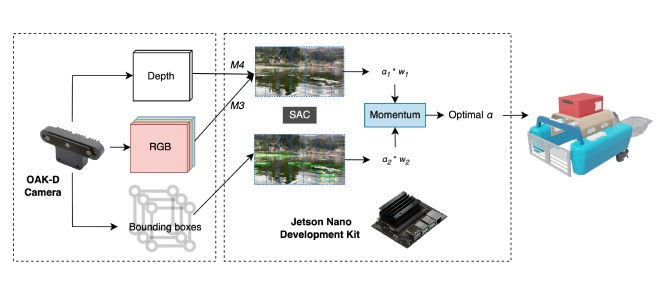
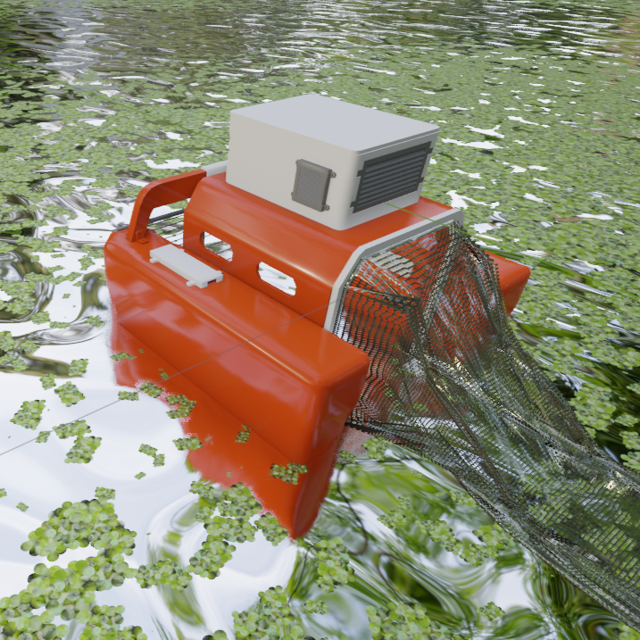
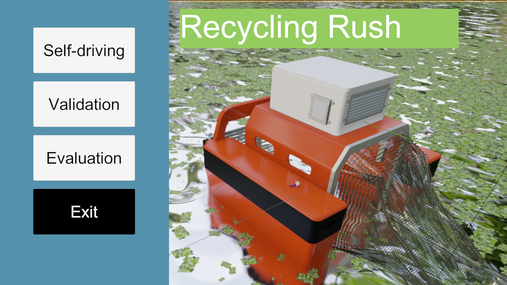

 

<p align="center">

</p>

<div align="center">
  <a href="#Overview"><b>Overview</b></a> |
  <a href="#USV"><b>USV</b></a> |
  <a href="#SAE"><b>SAE</b></a> |
  <a href="#Simulator"><b>Simulator</b></a> |
  <a href="#Results"><b>Results</b></a> |
  <a href="#Citing"><b>Citing</b></a>
</div>

# Overview

Deficient domestic wastewater management, industrial waste, and floating debris are some leading factors that contribute to inland water pollution. The surplus of minerals and nutrients in overly contaminated zones can lead to the invasion of floating weeds. *Lemnoideae*, commonly known as duckweed, is a family of floating plants that has no leaves or stems and forms dense colonies with a fast growth rate. If not controlled, duckweed establishes a green layer on the surface and depletes fish and other organisms of oxygen and sunlight.


Consequently, we propose an open-source unmanned surface vehicle (USV) for automatic duckweed removal that costs less than $500. The USV uses 3D-printed parts and common components that can be easily purchased. It is worth mentioning that the proposed approach won the First Global Prize in the [OpenCV AI Competition 2022](https://opencv.org/core-opencv/), organized by the [OpenCV Foundation](https://opencv.org/). Moreover, further prototyping details and testing results are available in the paper: 

[Edwin Salcedo](https://www.linkedin.com/in/edwinsalcedo/), [Yamil Uchani](https://www.linkedin.com/in/yamiluchani), [Misael Mamani](https://www.linkedin.com/in/misaelmq680), and [Mariel Fernandez](https://www.linkedin.com/in/mariel-fernandez-baldivieso-7ba9a0263),
*Towards Continuous Floating Invasive Plant Removal Using Unmanned Surface Vehicles and Computer Vision*, IEEE Access 2024.

[[Paper]](https://ieeexplore.ieee.org/document/10385136) [[Video Abstract]](https://youtu.be/yTdTHCYgbhM) 

# USV

## CAD Design

<p align="center">

</p>

This section contains the CAD designs for the Unmanned Surface Vehicle (USV) proposed for the collection of duckweed. It includes all the parts that were used to 3D print the vehicle, such as the "Control Box", "Main Body", "Floaters", and "Main Grid".

### Part Files
- [`Aux_1`](https://github.com/EdwinTSalcedo/RecyclingRush/blob/CAD_Design_USV/USV/Aux_1.SLDPRT): Support structures.
- [`Aux_2`](https://github.com/EdwinTSalcedo/RecyclingRush/blob/CAD_Design_USV/USV/Aux_2.SLDPRT): Support structures.
- [`Aux_3`](https://github.com/EdwinTSalcedo/RecyclingRush/blob/CAD_Design_USV/USV/Aux_3.SLDPRT): Support structures.
- [`BackSupport`](https://github.com/EdwinTSalcedo/RecyclingRush/blob/CAD_Design_USV/USV/BackSupport.SLDPRT): Used for the net grip that collects water lentils.
- [`BatteryCover`](https://github.com/EdwinTSalcedo/RecyclingRush/blob/CAD_Design_USV/USV/BatteryCover.SLDPRT): Covers the battery housing area.
- [`BoltHolder`](https://github.com/EdwinTSalcedo/RecyclingRush/blob/CAD_Design_USV/USV/BoltHolder.SLDPRT): Holder for bolts.
- [`BoxLid`](https://github.com/EdwinTSalcedo/RecyclingRush/blob/CAD_Design_USV/USV/BoxLid.SLDPRT): Lid for the control box.
- [`ElectronicBox`](https://github.com/EdwinTSalcedo/RecyclingRush/blob/CAD_Design_USV/USV/ElectronicBox.SLDPRT): Housing for the electronic components.
- [`Flipper`](https://github.com/EdwinTSalcedo/RecyclingRush/blob/CAD_Design_USV/USV/Flipper.SLDPRT): Grip for the motors.
- [`FloaterBase`](https://github.com/EdwinTSalcedo/RecyclingRush/blob/CAD_Design_USV/USV/FloaterBase.SLDPRT): Base structure for the floaters.
- [`FloaterLeftBack`](https://github.com/EdwinTSalcedo/RecyclingRush/blob/CAD_Design_USV/USV/FloaterLeftBack.SLDPRT): The left back part of the floaters.
- [`FloaterLeftFront`](https://github.com/EdwinTSalcedo/RecyclingRush/blob/CAD_Design_USV/USV/FloaterLeftFront.SLDPRT): The left front part of the floaters.
- [`FloaterRightBack`](https://github.com/EdwinTSalcedo/RecyclingRush/blob/CAD_Design_USV/USV/FloaterRightBack.SLDPRT): The right back part of the floaters.
- [`FloaterRightFront`](https://github.com/EdwinTSalcedo/RecyclingRush/blob/CAD_Design_USV/USV/FloaterRightFront.SLDPRT): The right front part of the floaters.
- [`FrontSupport`](https://github.com/EdwinTSalcedo/RecyclingRush/blob/CAD_Design_USV/USV/FrontSupport.SLDPRT): Frontal support structure.
- [`Grid`](https://github.com/EdwinTSalcedo/RecyclingRush/blob/CAD_Design_USV/USV/Grid.SLDPRT): Filtering grid.
- [`Joint`](https://github.com/EdwinTSalcedo/RecyclingRush/blob/CAD_Design_USV/USV/Joint.SLDPRT): Joint component.
- [`UpperStructure`](https://github.com/EdwinTSalcedo/RecyclingRush/blob/CAD_Design_USV/USV/UpperStructure.SLDPRT): Upper structure of the vehicle.
- [`VentLid`](https://github.com/EdwinTSalcedo/RecyclingRush/blob/CAD_Design_USV/USV/VentLid.SLDPRT): Lid for ventilation.


### Assembly File
- [`Assembly`](https://github.com/EdwinTSalcedo/RecyclingRush/blob/CAD_Design_USV/USV/Assembly.SLDASM): The complete assembly of the USV.

### Usage Instructions

The design was created in SolidWorks 2020, and it is recommended to use the same or a newer version for compatibility.

1. Download the desired part or assembly files from the repository.
2. Open the files using SolidWorks 2020 or a newer version.
3. To view or modify individual parts, open the part (.SLDPRT) files.
4. To view the complete assembly, open the `Assembly.SLDASM` file.

<!-- ## ROS system -->

# SAE

## Framework

Architectural layout encapsulating the three most essential components:

- A duckweed detection model embedded inside an OAK-D camera. 
- A steering angle classification model and a temporal weight module, namely *momentum*. Both were embedded inside a jetson nano development card.   

<p align="center">

</p>

## Duckweed detection

The database used for this model was built by scrapping images from Google Images and the [Global Biodiversity Information Facility](https://www.gbif.org/). The resulting 4,000 images were grouped into five categories according to the view-point of the duckweed colonies inside the samples: close, near-close, near-wide, wide, and empty. The final dataset is available [here](https://ieee-dataport.org/documents/duckweed-detection-dataset) (you'll need to create a IEEE Dataport account to access the dataset).

What follows is the list of experiments and trained models to replicate the results obtained using Yolov5 and the augmented versions of the dataset: 

#### Yolo v5

<table>
    <thead>
        <tr>
            <th>Dataset</th>
            <th>Weights</th>
            <th>IoU</th>
			<th>mAP</th>
			<th>Accuracy</th>
        </tr>
    </thead>
    <tbody>
        <tr>
            <td>Only real</td>
			<td><a href='https://drive.google.com/file/d/1-WlrXWoTPu3yEuURRsOsNEjTxwbRDJd6/view?usp=sharing'>Gdrive</a></td>
			<td>0.7431</td>
			<td>0.6426</td>
			<td>0.7276</td>
        </tr>
        <tr>
			<td>Only virtual </td>
            <td><a href='https://drive.google.com/file/d/1-w_Ewk6iC9fOJJ1V7Cs3zVUpBro9w3ZQ/view?usp=drive_link'>Gdrive</a></td>
			<td>0.8191</td>
			<td>0.6487</td>
			<td>0.8092</td>
        </tr>
        <tr>
            <td>Real + Virtual</td>
			<td><a href='https://drive.google.com/file/d/1-sHAc9iJtIiQfX_DbvE2BOccPEIdxtKX/view?usp=sharing'>Gdrive</a></td>
			<td>0.8502</td>
			<td>0.878</td>
			<td>0.8327</td>
        </tr>
        <tr>
            <td>Real + Virtual + Data Augmentation</td>
			<td><a href='https://drive.google.com/file/d/1-cMYuxlzFK7b9STXs7TAoE3pCXD3WU7e/view?usp=sharing'>Gdrive</a></td>
			<td>0.8625</td>
			<td>0.866</td>
			<td>0.8472</td>
        </tr>
    </tbody>
</table>

#### Yolo v8

<table>
    <thead>
        <tr>
            <th>Dataset</th>
            <th>Weights</th>
            <th>IoU</th>
			<th>mAP</th>
			<th>Accuracy</th>
        </tr>
    </thead>
    <tbody>
        <tr>
            <td>Only real</td>
			<td><a href='https://drive.google.com/file/d/1-kfFqMVYUzkwqlPPUIsO2SqbYUKPw2VY/view?usp=drive_link'>Gdrive</a></td>
			<td>0.8756</td>
			<td>0.7779</td>
			<td>0.8588</td>
        </tr>
        <tr>
			<td>Only virtual </td>
            <td><a href='https://drive.google.com/file/d/1DNfr5-64qjNELy2xFfFHN2N_WPpo_HfF/view?usp=drive_link'>Gdrive</a></td>
			<td>0.874</td>
			<td>0.6016</td>
			<td>0.8889</td>
        </tr>
        <tr>
            <td>Real + Virtual</td>
			<td><a href='https://drive.google.com/file/d/1-iBiTEx8Cba_mg1a6Kqz7WGS8SG289pw/view?usp=sharing'>Gdrive</a></td>
			<td>0.8085</td>
			<td>0.6903</td>
			<td>0.7878</td>
        </tr>
        <tr>
            <td><b>Real + Virtual + Data Augmentation</b></td>
			<td><a href='https://drive.google.com/file/d/1-R5eD4rBFjyCe5hp8DqntJTGVIdF3kmn/view?usp=sharing'>Gdrive</a></td>
			<td>0.8942</td>
			<td>0.7992</td>
			<td>0.8796</td>
        </tr>
    </tbody>
</table>

Our data preprocessing approach, as well as our Yolov5 and Yolov8 implementations can be found [here](https://github.com/EdwinTSalcedo/RecyclingRush/tree/master/duckweed_detection). 

## Steering angle classification

We tested two approaches for SAC: first, by collecting a syntethic dataset using a bespoke virtual environment and training DL classifiers. This approach, including object detection and moment, was named as *M3*. Then, we tried to classify steering angle using stereo vision along with object detection and momentum, which we later named *M4*. 

The final dataset acquired for M3 can be shared upon request. The dataset weights 48.66 Gb in total, which prevented us to share it online. Yet, the results and pretrained models using general classifiers from [TorchVision](https://pytorch.org/vision/stable/models.html) are available below: 

<table>
    <thead>
        <tr>
            <th>Model</th>
            <th>Weights</th>
            <th>Accuracy</th>
			<th>Recall</th>
			<th>Precision</th>
			<th>Sensitivity</th>
			<th>F1-score</th>
			<th>Weight</th>
        </tr>
    </thead>
    <tbody>
        <tr>
            <td>Resnet50</td>
			<td><a href='https://drive.google.com/file/d/1-XXRvScte3hGKhIU1JHtgmWRLVd9_I6G/view?usp=share_link'>Gdrive</a></td>
			<td>0.794</td>
			<td>0.793</td>
			<td>0.966</td>
			<td>0.792</td>
			<td>0.794</td>
			<td>90</td>
        </tr>
        <tr>
            <td>Resnet101</td>
			<td><a href='https://drive.google.com/file/d/1--Swga_5dJev-ckSsFyW4pZwi8P8LVhq/view?usp=share_link'>Gdrive</a></td>
			<td>0.812</td>
			<td>0.812</td>
			<td>0.969</td>
			<td>0.787</td>
			<td>0.812</td>
			<td>162.7</td>
        </tr>
		<tr>
            <td><b>EfficientNetv2m</b></td>
			<td><a href='https://drive.google.com/file/d/1-B2m77NeZ-4KC3nGuDSAE6xScPT7aJOq/view?usp=share_link'>Gdrive</a></td>
			<td>0.831</td>
			<td>0.831</td>
			<td>0.972</td>
			<td>0.833</td>
			<td>0.831</td>
			<td>203.1</td>
        </tr>
		<tr>
            <td>ConvNext</td>
			<td><a href='https://drive.google.com/file/d/1-21ywiqcYUKKyIO_cUiHuwNa4Tmsfi4z/view'>Gdrive</a></td>
			<td>0.736</td>
			<td>0.735</td>
			<td>0.956</td>
			<td>0.734</td>
			<td>0.736</td>
			<td>334.2</td>
        </tr>
		<tr>
            <td>ResNext</td>
			<td><a href='https://drive.google.com/file/d/1-5KqXbvpMumVHhgMUWskqJiNjYtchwWh/view?usp=share_link'>Gdrive</a></td>
			<td>0.824</td>
			<td>0.826</td>
			<td>0.971</td>
			<td>0.825</td>
			<td>0.824</td>
			<td>331.9</td>
        </tr>
    </tbody>
</table>

# Simulator

The project RecyclingRush required a simulator developed in Unity with the primary goal of resembling an underwater environment where a virtual agent collects water duckweeds. The simulator incorporates advanced features to enhance the agent's perception of the environment, such as the integration of Python-based deep learning models and stereo vision. 

<p align="center">
  
  
</p>

## Installation
### System Requirements
- [Unity](https://unity.com/): The simulator was created using version 2020.3.30f1, but is executable with newer versions.
- [Python](https://www.python.org/): We used python's version 3.11.3. It is suggestable to use conda or pyenv to install Python and its dependencies and avoid collisions.
- [Windows](https://www.microsoft.com/software-download/windows11): Note that the simulator was developed and tested  with Windows 11.

### Installation Steps
1. Clone this repository to your local machine.

    ```bash
    git clone git@github.com:EdwinTSalcedo/RecyclingRush.git recyclingrush
    cd recyclingrush/vehicle_simulator
    ```

2. Install the python dependencies for the detection models:

    ```bash
    pip install -r servers/requirements.txt
    ```
3. Additionally, ensure that the following Python packages are installed:
   ```bash
    opencv-python-headless
    numpy
    matplotlib
    torch
    torchvision
    Pillow
    requests
    ultralytics
    ```

Note that the folders: 

- **RecyclingRush** contains the pre-packaged simulator, which is runnable using the executable file `UnityCrashHandler64.exe`.

- **Autonomous aquatic robot:** contains the simulator's editable files.

- **servers:** contains python scripts that accept input data and returns the estimated angle as for M1, M2, M3 and M4 self-driving modalities.

4. Run the pre-packaged simulator (.exe) located in the "RecyclingRush" folder. This will create a folder named "!RecyclingRush" in your "Documents" directory.

5. Inside the newly created "!RecyclingRush" folder, copy the entire "servers" folder. This step is crucial for both the simulator and the program to utilize the Python models.


6. Load the folder RecyclingRush (inside recyclingrush/vehicle_simulator) with Unity. 

Open Unity and load the Unity project by navigating to the "Robot_acuatico_autonomo" folder.
If the project does not automatically initialize, follow these steps:
    - Click on "File" in the Unity editor.
    - Choose "Open Project."
    - Navigate to the "Robot_acuatico_autonomo" folder and open the project.

## Usage

Three different modes are available in the main menu of the simulator, each of which serves a specific function in model training and evaluation.

**Autonomous Driving:** Used for data collection during autonomous driving model training. It captures image sequences, considering both the angle and speed of the vehicle.

**Validation:** Allows manual image capture, establishing a database for model validation. Useful for evaluating model performance in controlled and specific scenarios.

**Evaluation:** The activation of the four modes in this environment allows the evaluation of duckweed detection and steering models. It facilitates comprehensive evaluations and performance analysis under various conditions.
<p align="center">
  
</p>

### Self-driving environment
The self-driving environment is set in an aquatic setting with various elements simulating a lake, featuring aquatic plants and boats. The purpose of this environment is to capture a sequence of images, taking into account the boat's angle and speed at any given moment. The interface comprises two interactive elements and two informational elements.

#### Interface Elements:

- **Menu:** This button allows users to navigate back to the main menu.

- **Record/Stop:** Activates or deactivates the image capture process.

- **Angle:** Displays the current steering angle of the boat. This information is reflected in the title of the captured image.

- **Velocity:** Shows the speed of the boat at the specific moment. The velocity information is also included in the image title.

<p align="center">
  
</p>

### Validation Environment

The validation environment is designed to simulate a port in the aquatic lake, resulting in a more organized layout of elements. The primary objective is to manually capture images chosen by the user. Additionally, users can adjust the camera to capture different types of images, both underwater and head-on. The interface features four buttons for user interaction.

#### Interface Elements:

- **Menu:** This button allows users to return to the main menu.

- **Capture:** This button is responsible for capturing and saving the selected image.

- **Up:** Adjusts the camera to face upwards.

- **Down:** Adjusts the camera to face downwards.

<p align="center">
  
</p>

### Evaluation Environment

The evaluation environment is designed for model testing and stereo camera usage to optimize the collection of duckweed and avoid obstacles efficiently. It displays a well-organized section of the lake for data collection, particularly focusing on the duckweed gathered over specific time intervals. The environment allows adjusting robot modalities with different characteristics.

#### Interface Elements:

- **Menu:** Returns to the main menu.

- **Restart:** Resets the robot's journey to test different modalities or changes.

- **Reduce:** Slows down the environment's time to capture journey details more effectively.

- **Increase:** Speeds up the environment's time to accelerate the journey if necessary.

- **Camera:** Changes the user's perspective on the boat.

- **Modality Selection:** A dropdown menu presenting 5 options:

  - **Manual:** Default modality, allowing user manipulation of robot movement.

  - **Modality 1:** Utilizes only the duckweed detection model with a drastic angle change.

  - **Modality 2:** Utilizes only the duckweed detection model but with momentum for smoother angle changes.

  - **Modality 3:** Considers two models - duckweed detection and direction detection, resulting in smoothed angle changes.

  - **Modality 4:** Incorporates the duckweed detection model and uses a stereo camera to determine obstacles to avoid.

<p align="center">
  
</p>

## File Overview

### Files C#

| **File** | **Type** | **Description** |
|-----------|-----------|-----------|
| CameraRotation.cs | Camera | Adjust the vertical rotation of the camera in the validation environment to optimize image capture. |
| Cameras.cs | Camera | Switch between three camera types to change the perspective point for visualization. |
| CaptureImage.cs | Camera | Capture an image from the validation environment and save it in the computer's documents section.|
| ImageCapture.cs | Camera | Capture a series of images in the self-driving environment, including data such as robot speed and angle, and save the content in the computer's documents. |
| Depthclient.cs | Clients | Process three images simultaneously in each evaluation environment cycle for duckweed and obstacle detection using stereo vision techniques. |
| Effnetclient.cs | Clients | Process one image in each evaluation environment cycle for duckweed and obstacle detection using trained models. |
| DuckweedCounter.cs | DataEvaluation | Count the remaining and collected duckweeds in the evaluation environment. |
| TimeManager.cs | DataEvaluation | Track the elapsed time since the start of the evaluation environment journey, and provide controls to accelerate or decelerate it. |
| AngleText.cs | Interface | Display the robot's driving angle in the self-driving environment. |
| TextController.cs | Interface | Activate the sequence image capture process in the self-driving environment and rename the button accordingly. |
| UI_HoldButton.cs  |  Interface | Add an additional function to the buttons to detect continuous pressing. |
| VelocityScript.cs   | Interface | Display the robot's speed in the self-driving environment. |
| ClearConsole.cs   | Load Menu |Clear the Unity console each time an environment is initiated to prevent saturation |
| LoadingScreenController.cs   | Load Menu | Asynchronously initiate the environment, generating elements before starting.|
| Closeprogram.cs  | Main Menu |Close the application.|
| Create_documents.cs  | Main Menu |Create a container folder for files generated in each environment.|
| Gameagain.cs   | Main Menu |Save the startup configuration of the evaluation environment.|
| SelectWorld.cs  | Main Menu |Change the scenario as specified.|
| Modality1.cs  <br> Modality2.cs  <br> Modality3.cs  <br> Modality4.cs  | Servers |Activate their respective servers based on the chosen mode in the evaluation environment.|
| Nox.cs  | System |Deactivate all elements in the current scenario.|
| Rest.cs  | System |Activate the stereo detection client.|
| AutonomousMovement.cs | Vehicle |Modify vehicle movement based on data received from the server.|
| Floats.cs | Vehicle |Simulate aquatic movement for the robot.|
| Movement.cs | Vehicle |Handle user-initiated vehicle movement.|

### Files Python
| **File** | **Type** | **Description** |
|-----------|-----------|-----------|
| Servermodality1.py <br> Servermodality2.py <br> Servermodality3.py <br> Depthserver.py | Servers |The servers responsible for handling the processing of program images operate by utilizing models and stereo vision to detect duckweeds and their orientations.|

### Files Model
| **File** | **Type** | **Description** |
|-----------|-----------|-----------|
| Best.pt | Yolov8 |The YOLOv8 model tasked with detecting lentils in the processed images.|
| Steering_estimator.pt | Resnet |The ResNet model designed to determine the correct angle for the robot to avoid obstacles.|

<!-- # Results -->

# Citing

If you find our work useful in your project, please consider to cite the following paper. Give RecyclingRush a star ⭐ on GitHub and share it with your friends and colleagues. With your support, we can continue to innovate in the field of autonomous vehicles for water quality management.

```
@article{salcedo2024,
  title={Towards Continuous Floating Invasive Plant Removal Using Unmanned Surface Vehicles and Computer Vision},
  author={Salcedo, Edwin and Uchani, Yamil and Mamani, Misael and Fernandez, Mariel},
  journal={IEEE Access},
  year={2024},
  publisher={IEEE},
  doi={10.1109/ACCESS.2024.3351764},
  url={https://doi.org/10.1109/ACCESS.2024.3351764}
}
```

