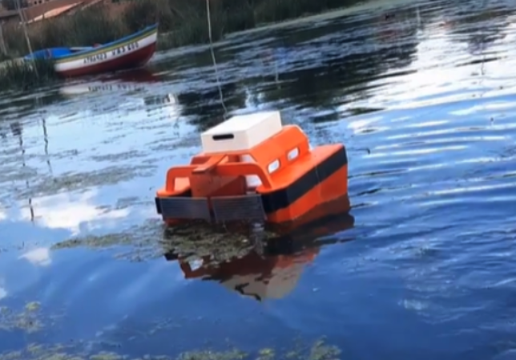

<p align="center">

</p>


<div align="center">
  <a href="#Overview"><b>Overview</b></a> |
  <a href="#Our approach"><b>USV</b></a> |
    <a href="#Our approach"><b>SAE</b></a> |
  <a href="#Our approach"><b>Simulator</b></a> |
  <a href="#Results"><b>Results</b></a> |
  <a href="#Citing"><b>Citing</b></a>
</div>

# Overview

Deficient domestic wastewater management, industrial waste, and floating debris are some leading factors that contribute to inland water pollution. The surplus of minerals and nutrients in overly contaminated zones can lead to the invasion of  floating weeds. *Lemnoideae*, commonly known as duckweed, is a family of floating plants that has no leaves or stems and forms dense colonies with a fast growth rate. If not controlled, duckweed establishes a green layer on the surface and depletes fish and other organisms of oxygen and sunlight.


Consequenly, we propose an open-source unmanned surface vehicle (USV) for automatic duckweed removal that costs less than $500. The USV uses 3D printed parts and common components that can be easily purchased. It is worth mentioning that the proposed approach won the First Global Prize in the [OpenCV AI Competition 2022](https://opencv.org/core-opencv/), organized by the [OpenCV Foundation](https://opencv.org/). Moreover, further prototyping details and testing results are available in the paper: 

[Edwin Salcedo](), [Yamil Uchani](), [Misael Mamani](), and [Mariel Fernandez](),
*Towards Continuous Floating Invasive Plant Removal Using Unmanned Surface Vehicles and Computer Vision*, IEEE Access 2024.

[[Paper]]() [[Project page]]() 

# Citing

If you find our work useful in your project, please consider to cite the following paper. Give RecyclingRush a star ⭐ on GitHub and share it with your friends and colleagues. With your support, we can continue to innovate and push the boundaries of what's possible in water quality management research using autonomous vehicles.

```
@article{salcedo2024,
	author={Salcedo, Edwin and Uchani, Yamil and Mamani, Misael and Fernandez, Mariel},
	title={Towards Continuous Floating Invasive Plant Removal Using Unmanned Surface Vehicles and Computer Vision},
	journal={IEEE Access},
	year={2024},
	number={1},
	doi={10.1109/ACCESS.2024.3351764},
	url={https://doi.org/10.1109/ACCESS.2024.3351764}
}
```

