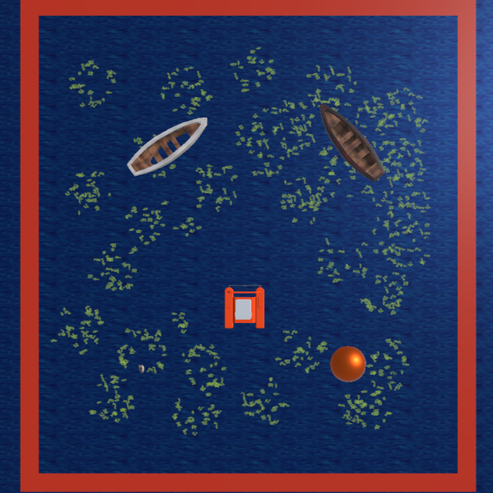

# Autonomous Acuatic Robot

Last Updated: December 19th, 2023

## Table of Contents
<div align="center" style="background-color: #6495ED; padding: 10px;">
  <a href="#description" style="color: #FF00FF;"><b>Description</b></a> |
  <a href="#features" style="color: #FF00FF;"><b>Features</b></a> |
  <a href="#installation" style="color: #FF00FF;"><b>Installation</b></a> |
  <a href="#usage" style="color: #FF00FF;"><b>Usage</b></a> |
  <a href="#scripts" style="color: #FF00FF;"><b>Scripts</b></a> |
  <a href="#contributions" style="color: #FF00FF;"><b>Contributions</b></a> |
  <a href="#license" style="color: #FF00FF;"><b>License</b></a> |
  <a href="#contact" style="color: #FF00FF;"><b>Contact</b></a>
</div>

## Additional Images

<p align="center">
  
  
</p>

<p align="center">
  <i>Left: CAD Design. Right: Simulator.</i>
</p>


## Description
This project is an aquatic simulator developed in Unity with the primary goal of simulating an underwater environment where a virtual agent collects water duckweeds. The simulator incorporates advanced features, such as the use of external Python servers for integrating object detection models based on YOLOv5 and ResNet. Additionally, stereo cameras are utilized to enhance the agent's perception of the environment.

## Features
- **Water duckweed Collection:** The virtual agent is designed to efficiently collect water duckweeds in a simulated aquatic environment.

- **Integration of Detection Models:** External Python servers are employed to integrate object detection models based on YOLOv5 and ResNet. This enables the agent to detect and react to objects in its surroundings.

- **Stereo Cameras:** A stereo camera setup is implemented to improve the three-dimensional perception of the environment and facilitate decision-making for the agent.

## Installation
### System Requirements
- [Unity](https://unity.com/)
- [Python](https://www.python.org/)

### Installation Steps

1. **Install Unity Hub and Download Unity 2020.3.30f1 or Later:**
   - Install Unity Hub.
   - Download and install Unity version 2020.3.30f1 or a more recent version.


2. **Configure the Python Environment:**
   - Ensure you have Python version 3.11.3 installed.
   - Install Python dependencies for the detection models:

    ```bash
    pip install -r requirements.txt
    ```

   - Additionally, ensure that the following Python packages are installed:
     ```bash
     opencv-python-headless
     numpy
     matplotlib
     torch
     torchvision
     Pillow
     requests
     ultralytics
     ```

3. **Clone the Repository to Your Local Machine:**
   
    ```bash
    git clone https://github.com/your_username/repository-name.git
    cd repository-name
    ```

4. **Locate the Unity Project:**
   - Use Unity Hub to locate the Unity project folder.
   - Search for and open the "RecyclingRush\vehicle_simulator\Autonomous aquatic robot" folder with Unity Hub.


### Inspect Subfolders:

- **Autonomous aquatic robot:** This folder contains the Unity project for modification.
- **RecyclingRush:** Use the pre-packaged simulator by running "Autonomous aquatic robot.exe".
- **servers:** Contains Python models and requirements for the project.


### Initialize Simulator:

1. Run the pre-packaged simulator " file located in the "RecyclingRush" folder.
2. Verify that the "!RecyclingRush" folder has been created in your "Documents" directory.
   - If not, ensure the simulator was executed correctly in the previous step.
3. Place the entire "servers" folder inside the newly created "!RecyclingRush" folder. This step is crucial for both the simulator and the program to utilize the Python models.
4. Now, open Unity Hub and enter the project for further modifications.

## Usage

### Simulator:

- Run the pre-packaged simulator (.exe) from the "RecyclingRush" folder to interact with the virtual environment.

### Python Models:

- The Python models in the "servers" folder are used for water duckweed and obstacle detection by the simulator.

### Unity Project:

- Open and modify the Unity project located in the "Robot_acuatico_autonomo" folder according to your requirements.

## Additional Notes

- Make sure your system meets the requirements for running the simulator and Python models.

- Customize the Unity project as needed, taking into account environmental constraints and the power of your computer for ride performance.

- For any questions or problems, contact the development team using the contact information provided in the README.
 
## Environments

Three different modes are available in the main menu of the simulator, each of which serves a specific function in model training and evaluation.

**Autonomous Driving:** Used for data collection during autonomous driving model training. It captures image sequences, considering both the angle and speed of the vehicle.

**Validation:** Allows manual image capture, establishing a database for model validation. Useful for evaluating model performance in controlled and specific scenarios.

**Evaluation:** The activation of the four modes in this environment allows the evaluation of duckweed detection and steering models. It facilitates comprehensive evaluations and performance analysis under various conditions.
<p align="center">
  
</p>

<p align="center">
  <i>Main Menu.</i>
</p>

### Self-driving environment
The self-driving environment is set in an aquatic setting with various elements simulating a lake, featuring aquatic plants and boats. The purpose of this environment is to capture a sequence of images, taking into account the boat's angle and speed at any given moment. The interface comprises two interactive elements and two informational elements.

#### Interface Elements:

- **Menu:** This button allows users to navigate back to the main menu.

- **Record/Stop:** Activates or deactivates the image capture process.

- **Angle:** Displays the current steering angle of the boat. This information is reflected in the title of the captured image.

- **Velocity:** Shows the speed of the boat at the specific moment. The velocity information is also included in the image title.

<p align="center">
  
</p>
<p align="center">
  <i>Self-driving environment</i>
</p>

### Validation Environment

The validation environment is designed to simulate a port in the aquatic lake, resulting in a more organized layout of elements. The primary objective is to manually capture images chosen by the user. Additionally, users can adjust the camera to capture different types of images, both underwater and head-on. The interface features four buttons for user interaction.

#### Interface Elements:

- **Menu:** This button allows users to return to the main menu.

- **Capture:** This button is responsible for capturing and saving the selected image.

- **Up:** Adjusts the camera to face upwards.

- **Down:** Adjusts the camera to face downwards.

<p align="center">
  
</p>

<p align="center">
  <i>Validation environment</i>
</p>

### Evaluation Environment

The evaluation environment is designed for model testing and stereo camera usage to optimize the collection of duckweed and avoid obstacles efficiently. It displays a well-organized section of the lake for data collection, particularly focusing on the duckweed gathered over specific time intervals. The environment allows adjusting robot modalities with different characteristics.

#### Interface Elements:

- **Menu:** Returns to the main menu.

- **Restart:** Resets the robot's journey to test different modalities or changes.

- **Reduce:** Slows down the environment's time to capture journey details more effectively.

- **Increase:** Speeds up the environment's time to accelerate the journey if necessary.

- **Camera:** Changes the user's perspective on the boat.

- **Modality Selection:** A dropdown menu presenting 5 options:

  - **Manual:** Default modality, allowing user manipulation of robot movement.

  - **Modality 1:** Utilizes only the duckweed detection model with a drastic angle change.

  - **Modality 2:** Utilizes only the duckweed detection model but with momentum for smoother angle changes.

  - **Modality 3:** Considers two models - duckweed detection and direction detection, resulting in smoothed angle changes.

  - **Modality 4:** Incorporates the duckweed detection model and uses a stereo camera to determine obstacles to avoid.

<p align="center">
  
</p>

<p align="center">
  <i>Evaluation environment</i>
</p>

## File Overview

### Files C#

| **File** | **Type** | **Description** |
|-----------|-----------|-----------|
| CameraRotation.cs | Camera | Adjust the vertical rotation of the camera in the validation environment to optimize image capture. |
| Cameras.cs | Camera | Switch between three camera types to change the perspective point for visualization. |
| CaptureImage.cs | Camera | Capture an image from the validation environment and save it in the computer's documents section.|
| ImageCapture.cs | Camera | Capture a series of images in the self-driving environment, including data such as robot speed and angle, and save the content in the computer's documents. |
| Depthclient.cs | Clients | Process three images simultaneously in each evaluation environment cycle for duckweed and obstacle detection using stereo vision techniques. |
| Effnetclient.cs | Clients | Process one image in each evaluation environment cycle for duckweed and obstacle detection using trained models. |
| DuckweedCounter.cs | DataEvaluation | Count the remaining and collected duckweeds in the evaluation environment. |
| TimeManager.cs | DataEvaluation | Track the elapsed time since the start of the evaluation environment journey, and provide controls to accelerate or decelerate it. |
| AngleText.cs | Interface | Display the robot's driving angle in the self-driving environment. |
| TextController.cs | Interface | Activate the sequence image capture process in the self-driving environment and rename the button accordingly. |
| UI_HoldButton.cs  |  Interface | Add an additional function to the buttons to detect continuous pressing. |
| VelocityScript.cs   | Interface | Display the robot's speed in the self-driving environment. |
| ClearConsole.cs   | Load Menu |Clear the Unity console each time an environment is initiated to prevent saturation |
| LoadingScreenController.cs   | Load Menu | Asynchronously initiate the environment, generating elements before starting.|
| Closeprogram.cs  | Main Menu |Close the application.|
| Create_documents.cs  | Main Menu |Create a container folder for files generated in each environment.|
| Gameagain.cs   | Main Menu |Save the startup configuration of the evaluation environment.|
| SelectWorld.cs  | Main Menu |Change the scenario as specified.|
| Modality1.cs  <br> Modality2.cs  <br> Modality3.cs  <br> Modality4.cs  | Servers |Activate their respective servers based on the chosen mode in the evaluation environment.|
| Nox.cs  | System |Deactivate all elements in the current scenario.|
| Rest.cs  | System |Activate the stereo detection client.|
| AutonomousMovement.cs | Vehicle |Modify vehicle movement based on data received from the server.|
| Floats.cs | Vehicle |Simulate aquatic movement for the robot.|
| Movement.cs | Vehicle |Handle user-initiated vehicle movement.|

### Files Python
| **File** | **Type** | **Description** |
|-----------|-----------|-----------|
| Servermodality1.py <br> Servermodality2.py <br> Servermodality3.py <br> Depthserver.py | Servers |The servers responsible for handling the processing of program images operate by utilizing models and stereo vision to detect duckweeds and their orientations.|

### Files Model
| **File** | **Type** | **Description** |
|-----------|-----------|-----------|
| Best.pt | Yolov8 |The YOLOv8 model tasked with detecting lentils in the processed images.|
| Steering_estimator.pt | Resnet |The ResNet model designed to determine the correct angle for the robot to avoid obstacles.|
## Contributions
If you wish to contribute to this project, please follow these guidelines:

1. Fork the repository.

2. Create a branch for your contribution:

    ```bash
    git checkout -b feature/new-feature
    ```

3. Develop and test your changes.

4. Submit a pull request to the main branch of the original repository.

## License
This project is licensed under the [License Name]. Refer to the LICENSE file for more details.

## Contact
For questions or comments, you can reach out to the development team:

- **Developer Name:** [Yamil Ronald Uchani Guachalla]
- **Email:** [yamilronalduchaniguachalla@gmail.com]